# Creational Design Patterns
_______________________________________________________________________________

## Objectives
1. Study and understand the Creational Design Patterns.
2. Choose a domain, define its main classes/models/entities 
and choose the appropriate instantiation mechanisms.
3. Use some creational design patterns for object instantiation in a sample project.

## Used design patterns
1. Singleton
2. Builder
3. Protorype
4. Factory Method

## Implementation

### Singleton Pattern
        The CarManufacturer class implements the Singleton pattern. 
        The class has a private constructor and a getInstance() method 
        that returns the singleton instance of the class. 
        This ensures that only one instance of the CarManufacturer class
        exists in the application.
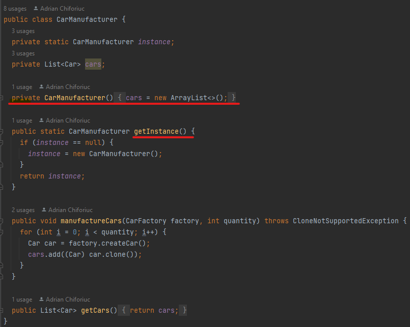

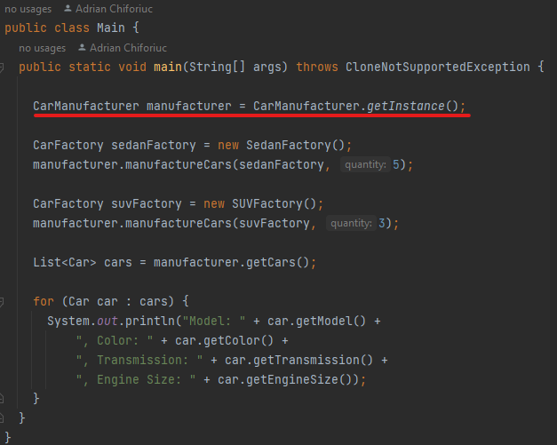

### Builder Pattern
        The CarBuilder interface and CarBuilderImpl class implement the Builder pattern. 
        The CarBuilder interface defines the methods to build a car, 
        and the CarBuilderImpl class provides implementations for these methods to create 
        a new Car object with the specified attributes. 
        This allows the creation of complex objects (i.e., cars) to be simplified and organized.

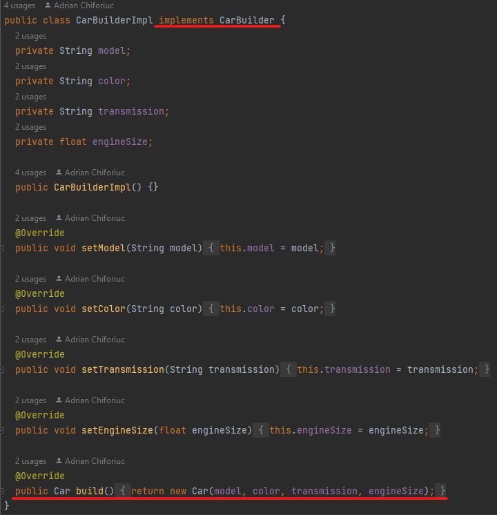

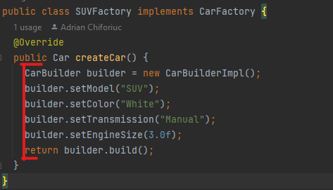

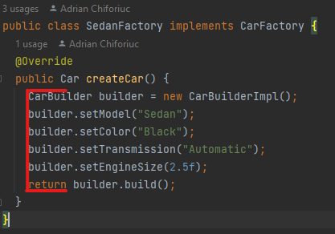

### Prototype Pattern
        The Car class implements the Cloneable interface to enable the 
        Prototype pattern. The CarManufacturer class uses the clone() 
        method to create copies of the car objects before adding them 
        to the list. This allows the creation of new objects (i.e., cars)
        by cloning existing objects, which can be more efficient 
        than creating new objects from scratch.

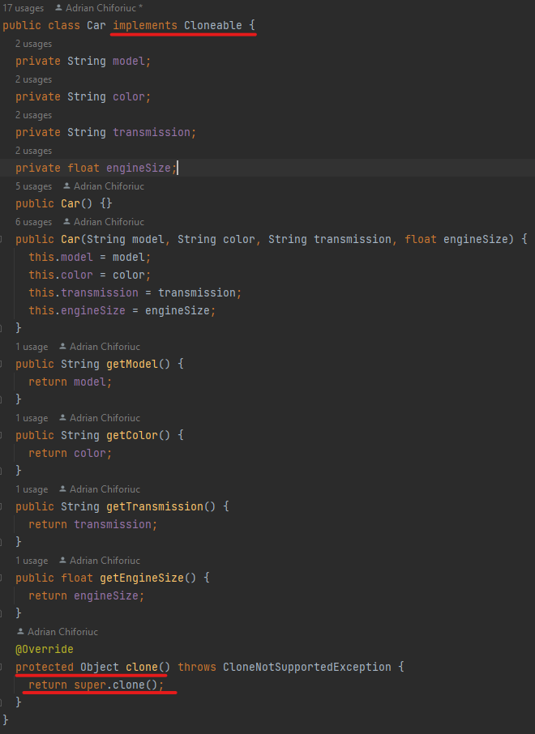

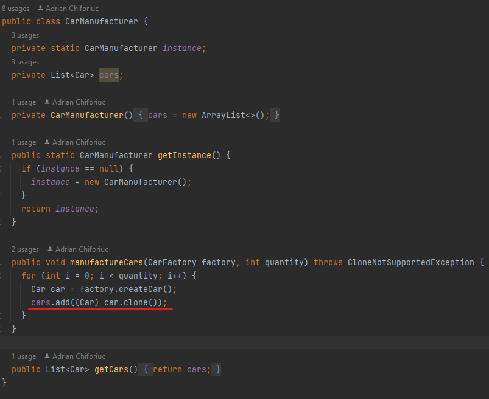

### Factory Method
        The CarFactory interface, SedanFactory and SUVFactory classes 
        implement the Factory Method pattern. The CarFactory interface 
        defines the createCar() method to create a new Car object, 
        and the SedanFactory and SUVFactory classes provide implementations 
        of this method to create different types of Car objects (i.e., Sedan and SUV cars).
        This allows the creation of objects to be delegated to subclasses, 
        which can provide different implementations of the same method.

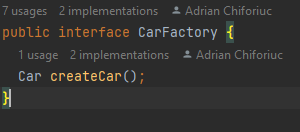

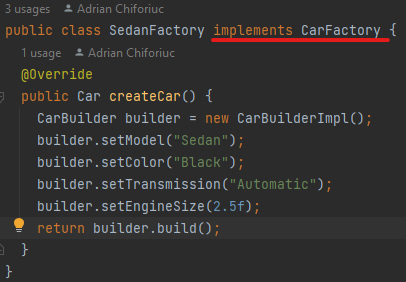

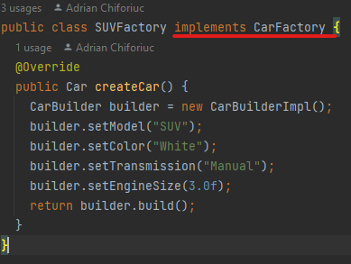

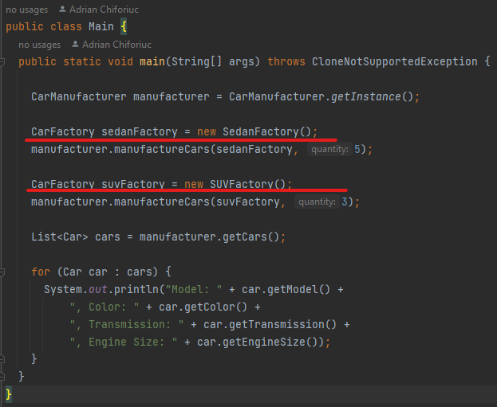

### Results after execution
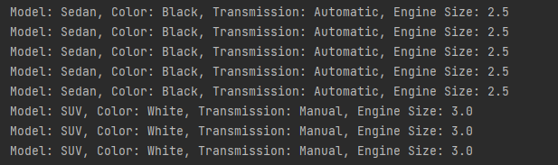

## Conclusion

In conclusion, programming is a vast field with numerous design patterns 
available to make the development process more efficient and manageable. 
The Singleton pattern is useful when there should only be one instance of 
a class at any given time, while the Builder pattern helps to simplify the 
creation of complex objects. The Prototype pattern provides a way to create 
new objects by copying existing ones, while the Factory Method pattern allows
for the creation of objects without specifying the exact class that will be 
instantiated. Understanding and utilizing these design patterns can greatly 
enhance the quality, efficiency, and maintainability of code in software 
development.